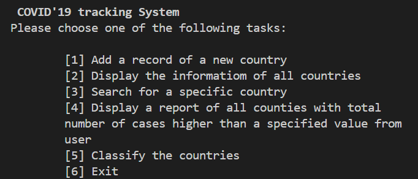
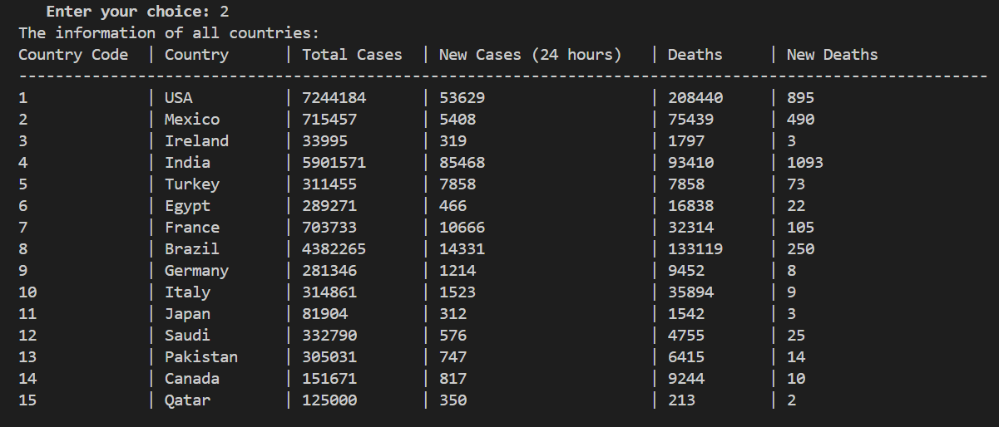
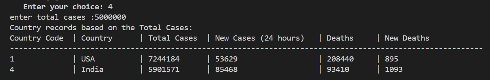
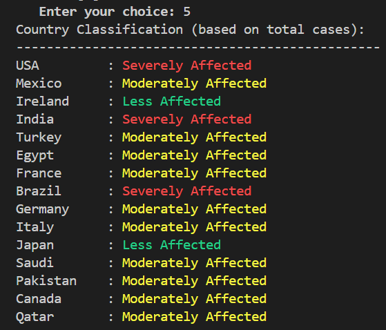
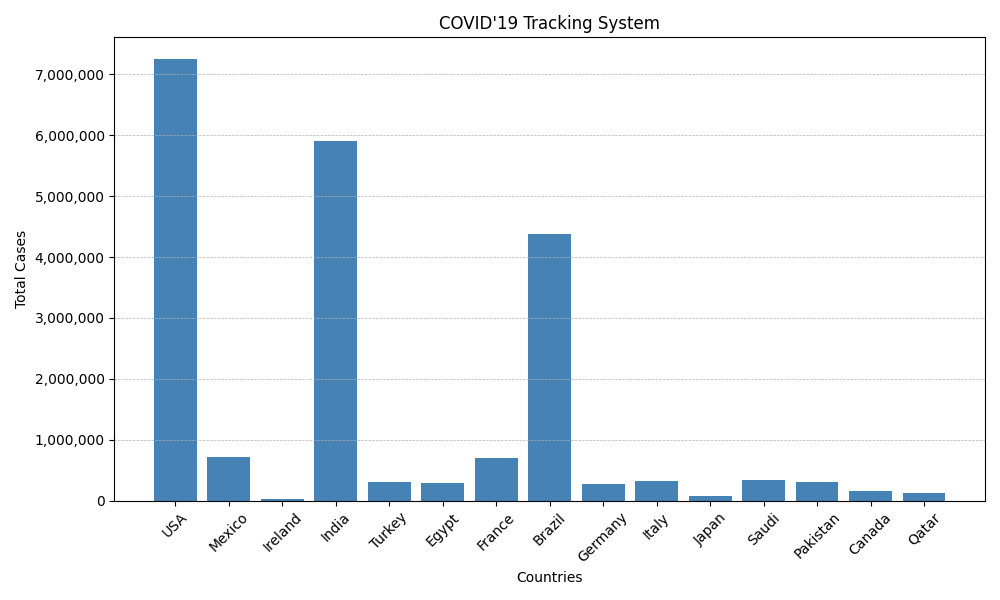

# 🦠 COVID-19 Tracking System

> **CMPS151 – Programming Concepts | Qatar University**

This project was developed as part of the CMPS151 course at Qatar University. It showcases core Python programming concepts including file handling, modular design, data filtering, and simple data visualization—all wrapped in a functional, console-based COVID-19 tracker.

---

## 📌 Overview

The COVID-19 Tracking System is a terminal application designed to manage and display pandemic-related statistics for various countries. Users can interact with the system to:

- Add and store records in a text file
- View all country statistics in a tabular format
- Search for specific countries by code
- Generate reports filtered by case count
- Classify countries based on severity levels
- Visualize data using bar charts

---

## 🚀 Key Features

- **Text-based data storage** using `.txt` files
- **Console-driven interface** with ANSI color-coded output
- **Dynamic bar charts** created using Matplotlib
- **Severity classification system**:
  - Severely Affected
  - Moderately Affected
  - Less Affected
- **Search and report tools** for quick insights

---

## 🖼️ Visual Previews

### 📋 Main Menu  


### 📊 All Country Data  


### 🔎 Country Lookup by Code  


### 📈 Filtered Report by Case Threshold  


### 🧾 Classification Output  


### 📉 Bar Chart Visualization  


---

## 📁 Project Structure

```
📂 Project Root
├── covid19_tracking_system.py         # Main script with menu & logic
├── functions.py                       # Contains helper functions
├── covid19_information.txt           # Stores COVID-19 data
├── screenshots/                      # Screenshot assets for documentation
└── README.md                         # Project documentation
```

---

## 🧠 Skills & Concepts Applied

- Python file input/output (I/O)
- Function-based programming and modular structure
- Loops, conditionals, and basic validation
- Console formatting with ANSI escape codes
- Data visualization using Matplotlib
- Organized, GitHub-friendly project layout

---

## 📦 Dependencies

- Python 3.x
- Matplotlib

To install Matplotlib (if not already installed):

```bash
pip install matplotlib
```

---

## 🛠 How to Run

1. Clone or download the repository.
2. Ensure all `.py` and `.txt` files are in the same directory.
3. Open a terminal and run:

```bash
python covid19_tracking_system.py
```

---

## 👩🏻‍💻 Author

**Islam Hamdi**  
Computer Science Student – Qatar University  
Course: CMPS151 – Programming Concepts  

---

## 📜 License

This project is for educational purposes only and is not licensed for commercial distribution.
